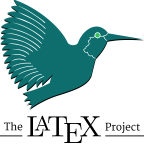

# Hi there, I'm Saurav 👋 

- 🔍 Actively searching for relevent Internship or werkstudent jobs. 
- 🌱 Currently learning Python, Machine Learning, LabView, MATLAB and Git.
- 🎓 Pursuing my Masters in Electronmics Engineering in Measurement and Instrumentation from Hochschule Bremen, Germany
- 📚 Currently doing CS50 Python from Harvard Univeristy, 100 Days of Python Coding from Dr.Angela Yu and Machine Learning from Stanford University.
- 🥅 2022 Goals: Learn Python and Machine Learning and make relevent projects and contribute to some open source projects. 
- ⚡ Fun fact: I love to draw, make hobby projects and play the Kalimba. 
- 👀 I’m interested in Robotics, Renewable Energy, AI, Machine Learning and much more!
- 📫 How to reach me: haldarsaurav13@gmail.com or +49 157 503 796 15

### Connect with me:

  

### Languages and Tools:

 
 

  
:zap: GitHub Stats

  

<!---
haldarsaurav/haldarsaurav is a ✨ special ✨ repository because its `README.md` (this file) appears on your GitHub profile.
You can click the Preview link to take a look at your changes.
--->
